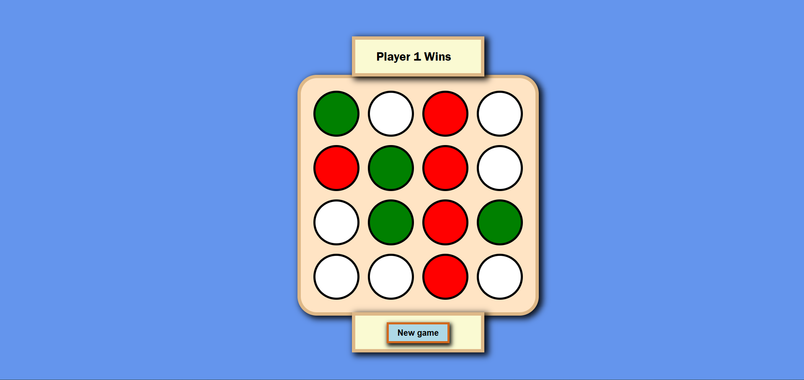

# React Connect-4 Game

This is a mini React project created as part of the **Advanced React Projects and Ecommerce Development (Module 3)** course offered by **Coursera** and developed by **Packt**.

It’s a simple **Connect Four**-style game implemented in React, showcasing state management, conditional rendering, and basic game logic with a smart computer move suggestion feature.

---

##  Features

- 4x4 Connect Four-style game board.
- Player-vs-Player and AI move suggestion.
- Smart AI move suggestion based on potential winning patterns.
- Game states: **Playing**, **Win**, and **Draw**.

---

##  Getting Started

### Prerequisites

Make sure you have the following installed:

- Node.js (v14+)
- npm or yarn

### Installation

1. Clone the repository:

   ```bash
   git clone https://github.com/shrMohtashm/connect4-game.git
   ```

2. Install dependencies:

   ```bash
   npm install
   ```

3. Run the development server:

   ```bash
   npm run dev
   ```   

##  Preview



---

##  License

This project is for educational purposes only as part of a Coursera course. All rights reserved by Packt and Coursera.

---